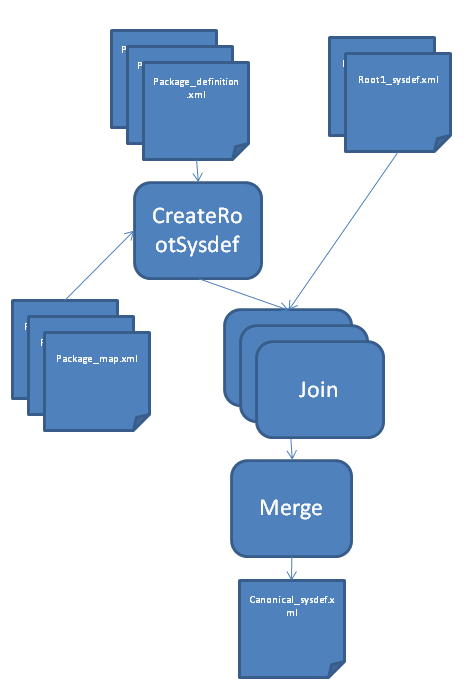

System Definition v3 support
============================

Helium is now supporting System Definition v3 to achieve build. This document explains how to configure Helium and 
 how input files are handled in the tool.
 

How to configure the feature?
-----------------------------

In order to enable the support you first need to define the **schema.new** property to true. Then define a resource ant element to either 
point to root definition file or package_definition.xml file.

e.g:
::
   
   <path id="system.definition.files">
      <pathelement path="${build.drive}/sf_sytem_definition.xml" />
      <fileset dir="${build.drive}" includes="root/*/*/package_definition.xml" />
   </path>

The previous example shows how you can configure your build to includes packages pointed by the sf_sytem_definition.xml, and a
set of additional packages directly referenced (root system definition will then be generated automatically, see package_map.xml section).

Package_map.xml
---------------

The package_map.xml provides mapping information between the package and it physical location under the build environment. The following
example show how to write a package_map.xml file for a package that should be placed under sf/mw:

::
   
   <?xml version="1.0"?>
   <PackageMap root="sf" layer="mw" />
   
This information is also required to build from package_definition.xml file directly, so a valid root system model file can be generated
automatically.

The package_map.xml must be placed under the root directory of the package. **package_definition.xml** without package_map.xml are considered
as invalid by the copying step and the automatic root system definition file generation. Only exception to that rule is for the virtual package
which must be placed exactly two level under the root of the package.

Example of package structure:
::
   
   + <root>
        + <layer>
             + <package>
                      - package_definition.xml
                      - package_map.xml
                      + component
                              + nokia_<component>_metadata
                                  - package_definition.xml  

Canonical system definition generation workflow
-----------------------------------------------
The following diagram describes the workflow of the canonical System Definition file generation.

The input of the workflow is the Ant resource identified by the **system.definition.files** id. Its content is then divided in two parts:
 * package_definition.xml files
 * other files considered as root system definition file.
 
The package_definition.xml (and package_map.xml) will be used to generated a root system file, which will be used
as any other root system definition file. The package_definition.xml will then be ignored from other operations.

Then workflow converges into the following regular operations:
 * joining each root system definition file into standalone model.
 * merging each root files.
 
The order of merging is defined by the order inside the resource, so to guaranty that order it is advised to use Ant path
element rather than filesets. Also the generated model is always included at then end. 

 