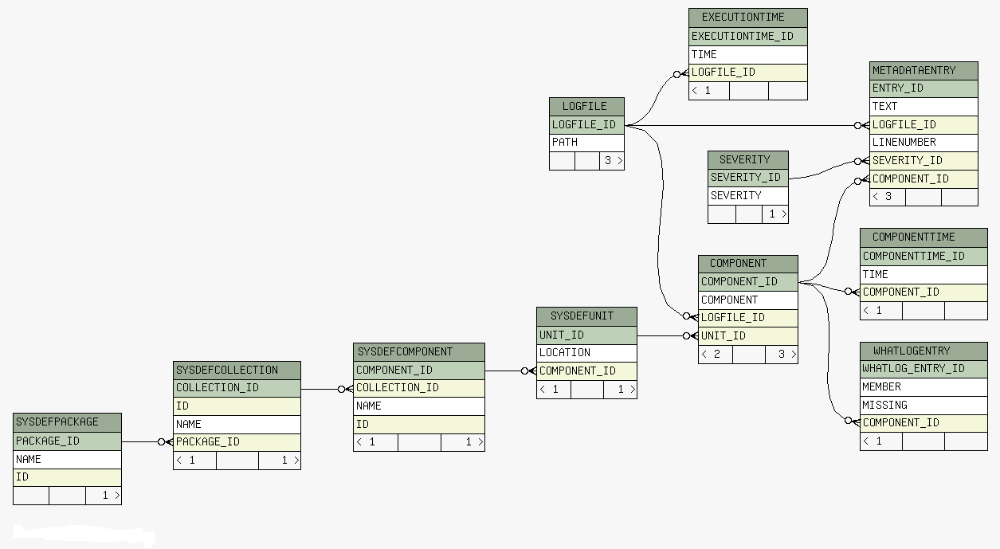
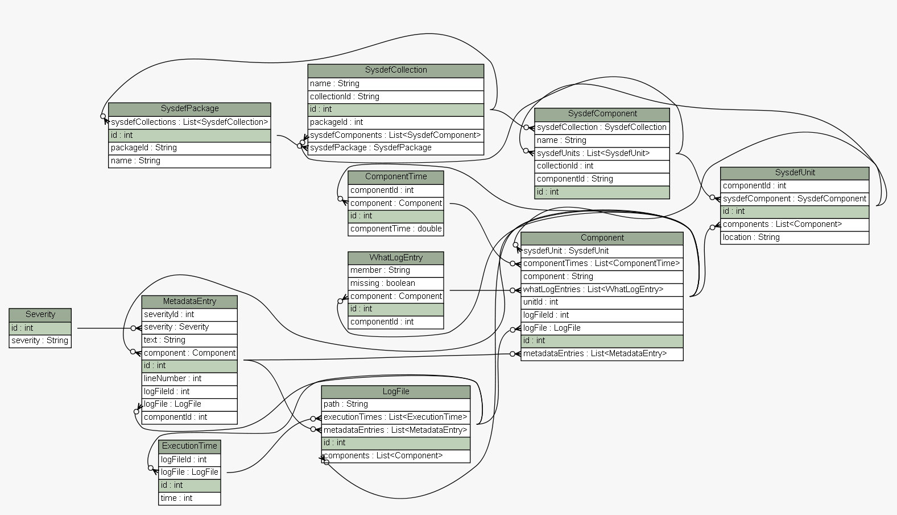

.. index::
  module: Configuring Metadata

====================
Configuring Metadata
====================

.. contents::

This document describes the purpose of metadata and how is being used in helium and
how it can be used by the customer.

Overview
========

Metadata is process to find the errors, warnings from the output log differnt section of the build
and store it to the database, which could be used during each stage of the build to process efficiently
and send details to diamonds, used for signaling, and generating summary file.

Metadata Details
================

1. Metadatarecord : Which is used to store the errors, warnings information to the database

    1.1. It takes the metadatainput (the type of log parsing to be used), currently supported parsing are
       
       a. sbsmetadatainput - sbs log processing (based on xml processing)
       
       b. textmetadatainput - general text log processing (based on text processing)
       
       c. policylogmetadatainput - policy log output processing (based on xml processing)
       
       d. antlogmetadatainput - ant log output processing (based on text processing)
       
       e. abldlogmetadatainput - abld log output processing (based on text processing)
       
       Please see ant doc for more details on metadatarecord.

   1.2 It takes the fileset containing list of log files
   
   1.3 It takes the metadata filter, list of regular expression for searching strings.
   
Metadata Filters
================

This document describes the usage of metadata filter to change the severity level during different stages of the build.

Overview
--------

Metadata filters are a set of regular expressions used to match the text of the build output and process the errors, categorize it,
and used to generate the output for diamonds, summary file, email output. A predefined set of ids are defined for each stage of the
build. For example for raptor compilation filter is defined as below,

The default definition of filterset.sbs is

.. code-block:: xml

    <hlm:metadatafilterset id="filterset.sbs">
        <metadatafilterset refid="filterset.common" />
    </hlm:metadatafilterset>

which is using the common definition which is,

.. code-block:: xml

    <hlm:metadatafilterset id="filterset.common">
        <metadatafilterset filterfile="${helium.dir}/config/metadata_regex.csv" />
    </hlm:metadatafilterset>

The complete list of predefined ids for various stages of the build are defined in the file,

helium/config/metadata_filter_config_default.xml

Each ID can be overridden to provide additional regular expressions to control the results of the build for different stages.

Two ways to add the regular expressions
---------------------------------------

 - Adding more than one regular expression

Define your own csv file and override it in your configuration as below (add this after importing helium.ant.xml file),

.. code-block:: xml

    <hlm:metadatafilterset id="filterset.sbs">
        <metadatafilterset filterfile="${s60.config}/config/metadata_regex.csv" />
    </hlm:metadatafilterset>

 - Adding just one regular expression

This can be done as below,

.. code-block:: xml

    <hlm:metadatafilterset id="filterset.sbs">
      <metadatafilter severity="error" regex=".*Error\s*:\s+.*" description="sbs compilation error" />
      <metadatafilterset filterfile="${helium.dir}/config/metadata_regex.csv" />
    </hlm:metadatafilterset>

Note
----

1. The order of metadatafilter / metadatafilterset is important, so the first one takes precedence over the second one.

2. Order is also preserved in the csv file, the expressions which are defined first has precedence over the later one.

3. All the regular expressions are JAVA patterns.
         

Usage in Helium
===============

Different build stages were processed and identified the type of output and added the metadatarecord
task for each build stage and captured the output in the database. And after storing it, using fmpp 
template the error information from database are processed to send to diamonds, raised signal accordingly.

Usage
=====

Examples:
    SBS comilation output in db:

.. code-block:: xml
    
    <hlm:metadatarecord database="${metadata.dbfile}">
        <hlm:sbsmetadatainput cleanLogFile="${sbs.clean.log.file}">
            <fileset casesensitive="false" file="${sbs.log.file}"/>
            <metadatafilterset refid="filterset.sbs" />
        </hlm:sbsmetadatainput>
    </hlm:metadatarecord>

This example is to process sbs output. The metadatainput is sbsmetadatainput to process the sbs log file, takes the sbs.log.file
uses the regular expression defined by filterset.sbs

.. code-block:: xml

    <hlm:metadatarecord database="${metadata.dbfile}">
        <hlm:abldmetadatainput>
            <fileset casesensitive="false" file="${build.log.dir}/${build.id}${cmaker.log.label}.export.cmaker.log" />
            <metadatafilterset refid="filterset.compile" />
        </hlm:abldmetadatainput>
    </hlm:metadatarecord>

This example process the cmaker output as abld output log. It takes abldmetadatainput as metadatainput
and the logfile as ${build.log.dir}/${build.id}${cmaker.log.label}.export.cmaker.log and the regular
expression is used from the reference filterset.compile.

Similarly any of the log output file can be easily processed in a similar way.

Database schema
===============

The following diagram describes the current database schema (for SQL based queries).

It is also possible to use the JPQL language which allows the usage of the Java ORM mapping class. This means that database will be represented
by their Java model class, table fields by the class attributes. This diagrams describes the JPQL diagram:

Example of queries:

SQL::
   
   select * from metadataentry as e, severity as s where e.severity_id = s.severity_id and s.severity = 'error'

JPQL::
   
   select e from MetadataEntry e JOIN e.severity s WHERE s.severity = 'error'
   

Using the Metadata framework with FMPP
======================================

The Metadata framework gives an efficient opportunity to record huge amounts of data in a fast and reliable way (timewise and memory consumption-wise).
Thanks to the ORMFMPPLoader database loader it is really simple to access those data and render them in  another format: HTML for easy to read build summary,
XML to communicate with other tools, text file...

Loading a database
------------------

A database can be loaded and assigned to a template variable using the pp.loadData functionnality from the FMPP task. The 'com.nokia.helium.metadata.ORMFMPPLoader'
accept one argument which is the path to the database.

Example::
   
   <#assign database = pp.loadData('com.nokia.helium.metadata.ORMFMPPLoader', "C:/path/to/database_db") >
    

Then the database variable can be used to access the database the following different ways:

 - jpasingle: Query with single result e.g: select count(s) from Severity s
 - jpa: allow iteration on the JPA object results: select s from Severity s
 - native:<type>: Native SQL format query, type is use to determine the object to use in the model
 
Accessing data using a JPA single query
---------------------------------------

The 'jpasingle' is the best way to access results from single values like count of entities. The jpasingle queries must be written in JPQL, 
please check the valid database schema in the previous section (case matters!).

Example of a template that will return the number of log files recorded in the database::
   
   <#assign database = pp.loadData('com.nokia.helium.metadata.ORMFMPPLoader', "C:/path/to/database_db") >
   Number of logfiles: ${database['jpasingle']['select l from LogFile l'][0]}
 
Accessing data using a JPA query
--------------------------------
 
The JPA query allows you to perform query and directly use JPA entity object directly inside the template. The jpa queries must be written in JPQL, 
please check the valid database schema in the previous section (case matters!).

In the following example the query loop through the available log files::
    
   <#assign database = pp.loadData('com.nokia.helium.metadata.ORMFMPPLoader', "C:/path/to/database_db") >
   <#list database['jpasingle']['select l from LogFile l'] as l>
   ${l.id}: ${l.path}
   </#list>
   

Accessing data using a native query
-----------------------------------

The native query enables you to perform SQL queries through the JDBC interface of the database. If native is used then make sure you use
the SQL schema.

In the following example the query loop through the available log files path::
   
   <#assign database = pp.loadData('com.nokia.helium.metadata.ORMFMPPLoader', "C:/path/to/database_db") >
   <#list table_info['native:java.lang.String']['SELECT l.PATH FROM LOGFILE as l'] as l>
   ${l}
   </#list>
   
   